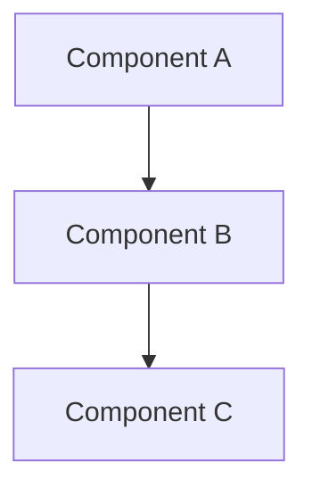
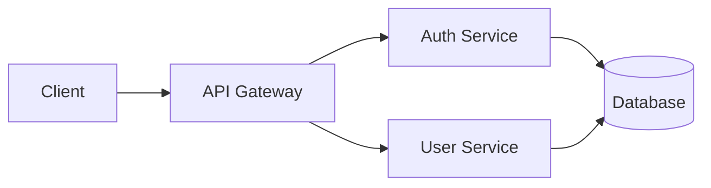
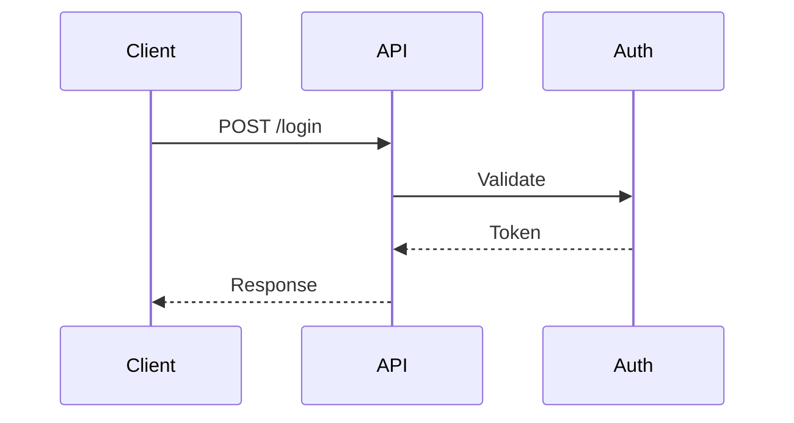

# 문서화 규칙 가이드

## 개요

세션 독립적인 개발을 위한 문서화 규칙입니다.
어떤 세션에서든 동일한 컨텍스트로 작업을 이어갈 수 있도록 합니다.

---

## 1. 문서 디렉토리 구조

```
docs/
├── requires/           # 요구사항 문서
│   ├── REQ-001-login.md
│   └── REQ-002-dashboard.md
│
├── spec/               # 설계 문서
│   ├── architecture/   # 아키텍처 설계
│   │   └── login.md
│   ├── api/           # API 설계
│   │   └── auth-api.md
│   ├── ui/            # UI/UX 설계
│   │   └── login-form.md
│   └── data/          # 데이터 모델
│       └── user-schema.md
│
├── tasks/             # 진행중 태스크
│   └── TASK-001-login.md
│
├── todo/              # 대기중 태스크
│   └── TODO-002-dashboard.md
│
├── complete/          # 완료된 문서
│   └── DONE-001-login.md
│
├── checklists/        # 체크리스트 템플릿
│   ├── requirements.md
│   ├── design.md
│   ├── implementation.md
│   └── review.md
│
├── history/           # 세션 히스토리
│   ├── 2025-01-25-session-1.md
│   └── 2025-01-25-session-2.md
│
└── reference/         # 참조 문서
    ├── style-guide.md
    ├── architecture.md
    └── conventions.md
```

---

## 2. 문서 네이밍 규칙

### 요구사항 문서
```
REQ-[번호]-[기능명].md
예: REQ-001-user-authentication.md
```

### 태스크 문서
```
TASK-[번호]-[기능명].md
예: TASK-001-login-implementation.md
```

### 완료 문서
```
DONE-[번호]-[기능명].md
예: DONE-001-login-implementation.md
```

### 히스토리 문서
```
YYYY-MM-DD-session-[N].md
예: 2025-01-25-session-1.md
```

---

## 3. 문서 템플릿

### 3.1 요구사항 문서 (REQ-XXX)

```markdown
# REQ-[번호]: [기능명]

## 메타 정보
- **작성일**: YYYY-MM-DD
- **상태**: Draft | Review | Approved
- **우선순위**: High | Medium | Low
- **관련 태스크**: TASK-XXX

---

## 1. 개요
[기능에 대한 간략한 설명]

## 2. 배경
[왜 이 기능이 필요한지]

## 3. 사용자 스토리
- As a [사용자], I want [기능], so that [이유]

## 4. 기능 요구사항

### 4.1 핵심 기능
- [ ] [기능 1]
- [ ] [기능 2]

### 4.2 입력/출력
**입력**:
- [입력 항목]

**출력**:
- [출력 항목]

### 4.3 예외 케이스
- [예외 상황 1]: [처리 방법]
- [예외 상황 2]: [처리 방법]

## 5. 비기능 요구사항
- 성능: [기준]
- 보안: [요구사항]

## 6. 제약 조건
- [제약 1]
- [제약 2]

## 7. 성공 기준
- [ ] [기준 1]
- [ ] [기준 2]

## 8. 참고
- [관련 문서 링크]
- [참고 자료]
```

### 3.2 설계 문서 (SPEC)

```markdown
# [기능명] 설계 문서

## 메타 정보
- **작성일**: YYYY-MM-DD
- **상태**: Draft | Review | Approved
- **관련 요구사항**: REQ-XXX

---

## 1. 개요
[설계 목적과 범위]

## 2. 아키텍처

### 2.1 컴포넌트 구조


### 2.2 데이터 흐름
[데이터가 어떻게 흐르는지 설명]

## 3. 인터페이스 정의

### 3.1 타입 정의
```typescript
// 핵심 타입만 정의 (구현 코드 X)
interface UserCredentials {
  email: string;
  password: string;
}

interface AuthResponse {
  token: string;
  user: User;
}
```

### 3.2 API 명세 (해당시)
| Method | Endpoint | Request | Response |
|--------|----------|---------|----------|
| POST | /api/auth/login | UserCredentials | AuthResponse |

## 4. 에러 처리
| 에러 코드 | 설명 | 처리 방법 |
|----------|------|----------|
| AUTH_001 | Invalid credentials | 에러 메시지 표시 |

## 5. 보안 고려사항
- [보안 항목 1]
- [보안 항목 2]

## 6. 테스트 계획
### 테스트 케이스
- [ ] 정상 케이스: [설명]
- [ ] 에러 케이스: [설명]

## 7. 참고
- 관련 설계 문서: [링크]
```

### 3.3 태스크 문서 (TASK-XXX)

```markdown
# TASK-[번호]: [태스크명]

## 메타 정보
- **생성일**: YYYY-MM-DD
- **상태**: Todo | In Progress | Review | Done
- **담당**: [에이전트/담당자]
- **관련 요구사항**: REQ-XXX
- **관련 설계**: docs/spec/xxx.md

---

## 1. 목표
[이 태스크의 목표]

## 2. 작업 항목
- [ ] [작업 1]
- [ ] [작업 2]
- [ ] [작업 3]

## 3. 진행 상황

### YYYY-MM-DD
- [진행 내용]
- [변경 사항]

## 4. 블로커/이슈
- [이슈가 있다면 기록]

## 5. 다음 단계
- [다음에 해야 할 작업]

## 6. 관련 파일
- `src/xxx.ts`
- `src/yyy.ts`

## 7. 테스트 결과
- [ ] 단위 테스트 통과
- [ ] 통합 테스트 통과
```

### 3.4 완료 문서 (DONE-XXX)

```markdown
# DONE-[번호]: [기능명]

## 메타 정보
- **완료일**: YYYY-MM-DD
- **시작일**: YYYY-MM-DD
- **관련 요구사항**: REQ-XXX
- **관련 설계**: docs/spec/xxx.md
- **관련 태스크**: TASK-XXX

---

## 1. 요약
[완료된 기능 요약]

## 2. 구현 내용

### 2.1 주요 변경사항
- [변경 1]
- [변경 2]

### 2.2 파일 목록
| 파일 | 변경 유형 | 설명 |
|------|----------|------|
| `src/xxx.ts` | 신규 | [설명] |
| `src/yyy.ts` | 수정 | [설명] |

## 3. 사용법
[기능 사용 방법]

## 4. 테스트 결과
- 단위 테스트: ✅ 통과
- 통합 테스트: ✅ 통과

## 5. 알려진 제한사항
- [제한사항 1]

## 6. 향후 개선사항
- [개선 1]
- [개선 2]

## 7. 참고
- [관련 문서 링크]
```

### 3.5 세션 히스토리

```markdown
# 세션 히스토리: YYYY-MM-DD #N

## 세션 정보
- **시작**: HH:MM
- **종료**: HH:MM
- **이전 세션**: YYYY-MM-DD-session-N.md

---

## 1. 오늘의 목표
- [ ] [목표 1]
- [ ] [목표 2]

## 2. 진행 내용

### [시간] [작업 내용]
- [상세 내용]
- [변경된 파일]

### [시간] [작업 내용]
- [상세 내용]

## 3. 완료 항목
- [x] [완료 1]
- [x] [완료 2]

## 4. 미완료/이슈
- [ ] [미완료 1] - [이유]

## 5. 내일 TODO
- [ ] [TODO 1]
- [ ] [TODO 2]

## 6. 메모/결정사항
- [중요한 결정이나 메모]

## 7. 관련 문서
- 수정된 문서: [링크]
- 생성된 문서: [링크]
```

---

## 4. 문서화 규칙

### 4.1 예시 코드 최소화

```markdown
## ✅ 좋은 예시

### 인터페이스 정의
```typescript
interface User {
  id: string;
  email: string;
  name: string;
}
```

위 인터페이스를 사용하여 사용자 정보를 관리합니다.

---

## ❌ 나쁜 예시

### 전체 구현 코드
```typescript
import { db } from './database';
import { hash } from 'bcrypt';

export class UserService {
  async createUser(email: string, password: string, name: string) {
    const hashedPassword = await hash(password, 10);
    const user = await db.user.create({
      data: {
        email,
        password: hashedPassword,
        name,
      },
    });
    return user;
  }

  async getUser(id: string) {
    return db.user.findUnique({ where: { id } });
  }
  // ... 100줄 더
}
```
```

### 4.2 다이어그램 활용

```markdown
## 아키텍처

### Mermaid 다이어그램 사용


### 시퀀스 다이어그램

```

### 4.3 상태 관리

```markdown
## 문서 상태 값
- **Draft**: 작성 중
- **Review**: 검토 중
- **Approved**: 승인됨
- **Deprecated**: 폐기됨

## 태스크 상태 값
- **Todo**: 대기 중
- **In Progress**: 진행 중
- **Review**: 검토 중
- **Done**: 완료
- **Blocked**: 차단됨
```

### 4.4 링크 규칙

```markdown
## 문서 간 링크

### 상대 경로 사용
- 같은 폴더: [문서](./other-doc.md)
- 상위 폴더: [문서](../other-folder/doc.md)

### 관련 문서 명시
모든 문서에 관련 문서 섹션 포함:
- 요구사항 → 설계 → 태스크 → 완료
```

---

## 5. 세션 관리

### 5.1 세션 시작 시
```markdown
1. 이전 세션 히스토리 확인
   - docs/history/ 최신 파일 읽기
   - TODO 항목 확인

2. 진행중 태스크 확인
   - docs/tasks/ 파일 확인
   - 상태가 "In Progress"인 항목

3. 새 히스토리 파일 생성
   - docs/history/YYYY-MM-DD-session-N.md
```

### 5.2 세션 진행 중
```markdown
1. 작업 내용 실시간 기록
   - 히스토리 파일에 진행 상황 추가

2. 문서 업데이트
   - 변경된 요구사항/설계 반영
   - 태스크 상태 업데이트
```

### 5.3 세션 종료 시
```markdown
1. 히스토리 마무리
   - 완료 항목 체크
   - 미완료 항목 및 이유 기록
   - TODO 정리

2. 태스크 상태 업데이트
   - 진행 상황 반영
   - 다음 단계 명시

3. 완료된 항목 이동
   - tasks/ → complete/ (완료 시)
```

---

## 6. 자동화 지원

### CLAUDE.md에 문서화 규칙 포함

```markdown
## 문서화 규칙

### 문서 생성 시
1. 적절한 템플릿 사용
2. 메타 정보 필수 포함
3. 관련 문서 링크

### 세션 관리
- 세션 시작: docs/history/ 히스토리 생성
- 세션 종료: 히스토리 저장, TODO 정리

### 예시 코드
- 인터페이스/타입 정의만 포함
- 구현 코드는 최소화
- 다이어그램으로 대체 가능하면 다이어그램 사용
```

---

## 다음 단계

- [에이전트 페르소나](05-agent-personas.md)
- [프로젝트 구조 템플릿](06-project-structure.md)
